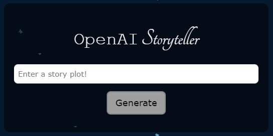
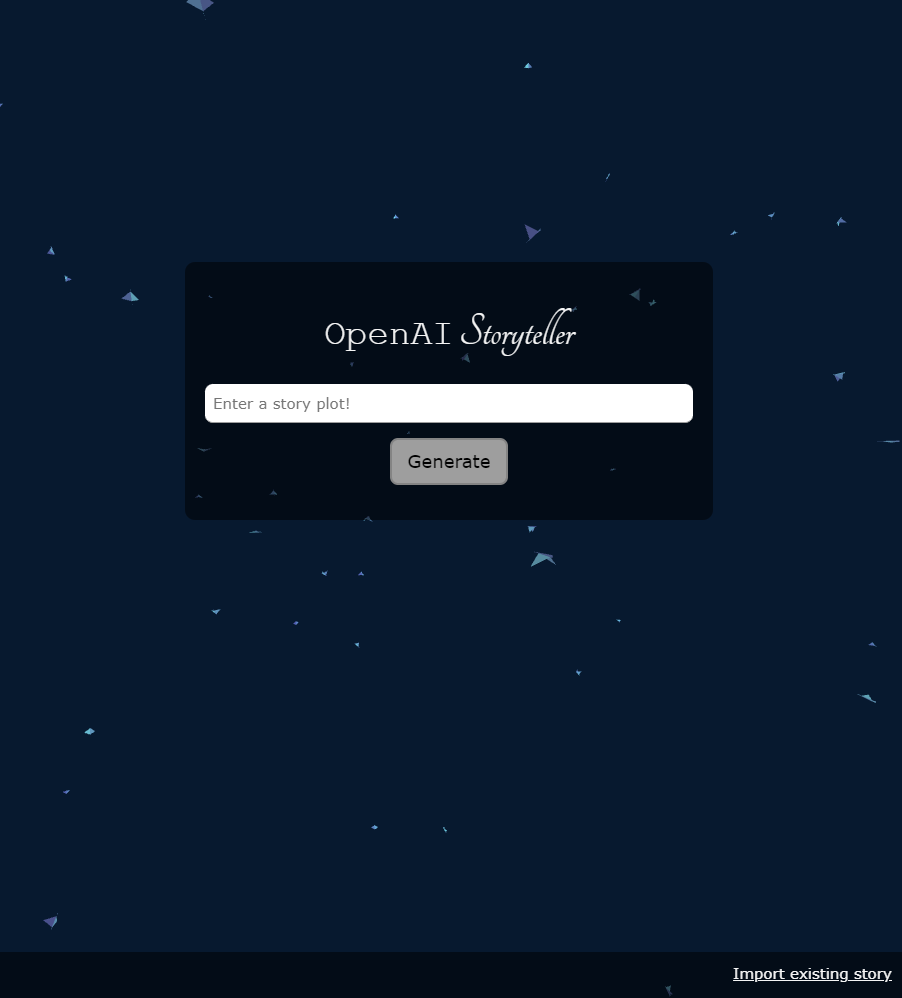
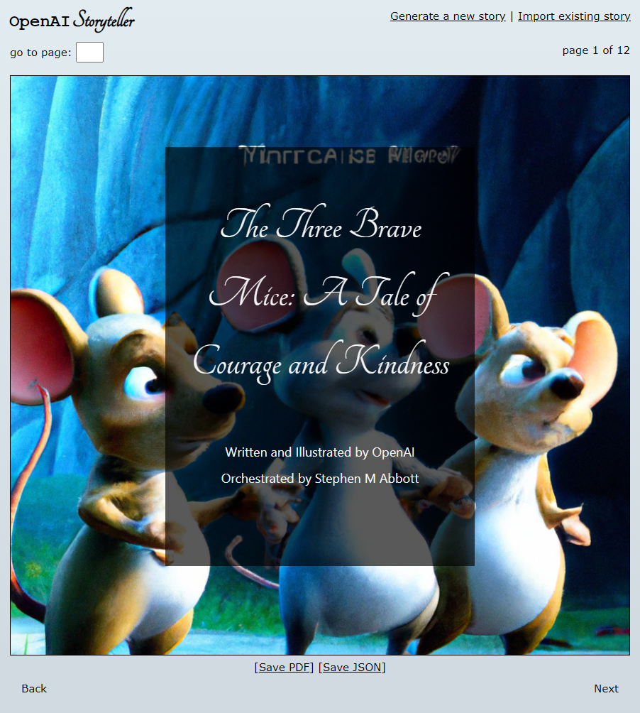
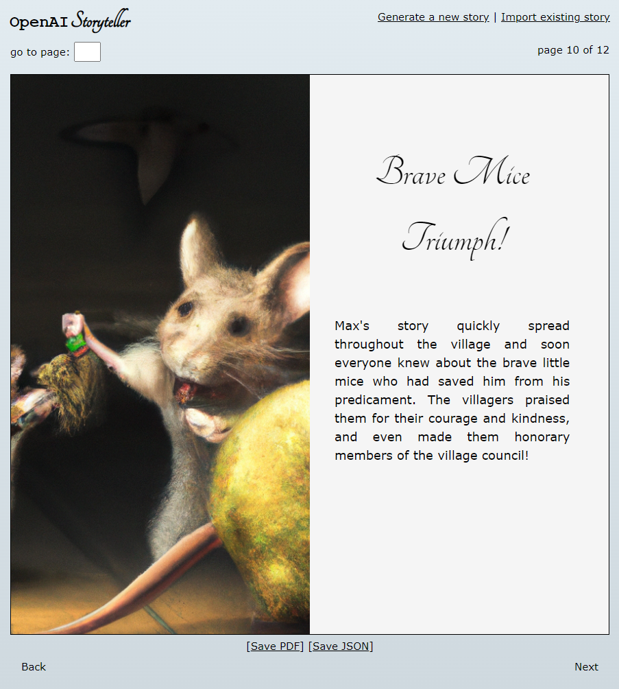
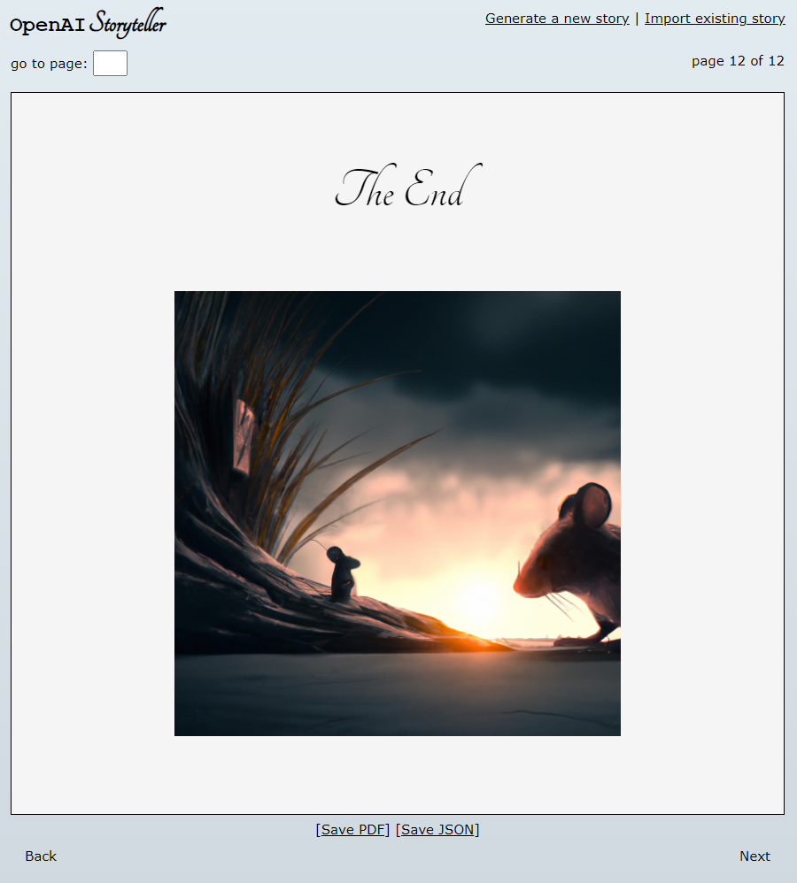

# openai-storyteller
This project is a web application that generates a story based on a provided plot using OpenAI's ChatGPT and DALL-E models. The resulting story is then illustrated and presented in an interactive web page.



## Features
- Accepts a plot as input and generates a corresponding story
- Illustrates the story with images generated using DALL-E
- Displays the story in an interactive web page
- Allows the user to download the story as a JSON file or a PDF document
- Provides the option to import a previously saved story as a JSON file


## Requirements
- Python 3.7 or later
- Flask
- XHTML2PDF
- OpenAI API key


## How to use
1. Clone the repository and install the required dependencies
    ```bash
    git clone https://github.com/user/story-generator.git
    cd story-generator
    pip install -r requirements.txt
    ```

2. Set up your OpenAI API key as an environment variable
    ```bash
    export OPENAI_API_KEY=your_api_key
    ```

3. Run the app using python app_runner.py

4. The app will be served at http://localhost:5000

5. On the home page, enter a plot and submit it to generate a story

6. The resulting story will be displayed on the page, with options to download it as a JSON file or a PDF document, or to import a previously saved story as a JSON file


## Docker
This repository contains a Dockerfile for building a Docker image for the openai-storyteller web app. The image is based on Python 3.8 and includes all the necessary dependencies for the app to run.

How to use:
1. Clone the repository and build the Docker image
    ```bash
    git clone https://github.com/user/openai-storyteller.git
    cd openai-storyteller
    docker build -t openai-storyteller .
    ```

2. Run the Docker container, replacing your_api_key with your own OpenAI API key
    ```bash
    docker run -p 5000:5000 -e OPENAI_API_KEY=your_api_key openai-storyteller
    ```

## Files
- `app_runner.py`: the main script to run the app
- `src/sanitize.py`: a module to sanitize user input
- `src/story_generator.py`: a module to generate the story and illustrate it using the OpenAI models
- `src/openai_stories.py`: a module to interact with OpenAI from the lense of storytelling
- `templates/`: a directory containing the HTML templates for the web pages

## Credits
- OpenAI's ChatGPT and DALL-E models: https://openai.com/
- Flask: https://flask.palletsprojects.com/
- XHTML2PDF: https://xhtml2pdf.readthedocs.io/


## Sample Screenshots



